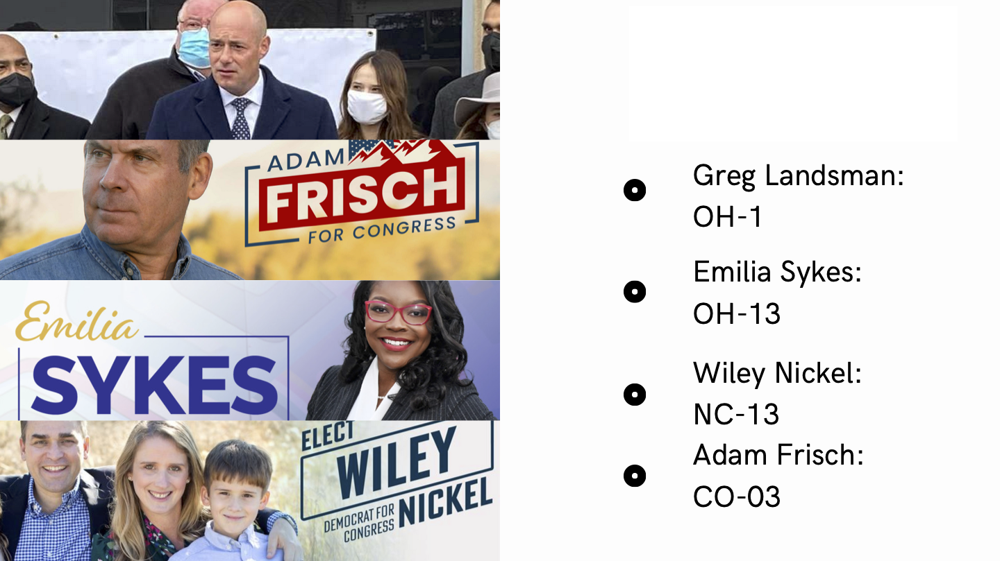
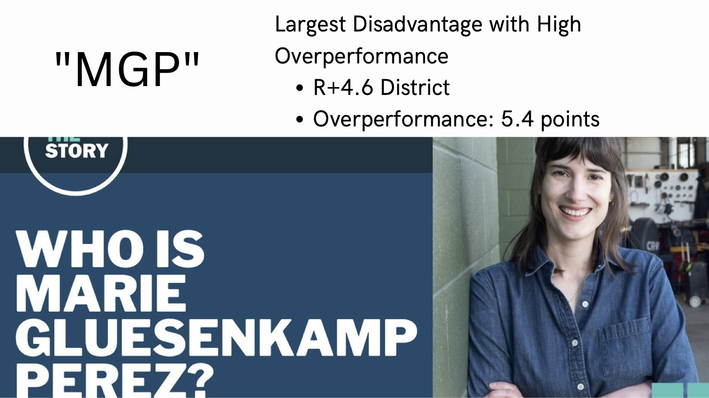

  
<h2 align="center">           </h2>

<h2 align="center">Winning in Trump Country</h2>

  

<h3 align="center">Examining the Twitter Messaging Strategies of Two Democratic Newcomers Who Overcame the Red Tide in the 2022 Midterms </h3>

  
<!-- TABLE OF CONTENTS -->
<!--details-->
  
 Table of Contents 

  <ol>
    <li>
      <a href="#introduction">Introduction</a>
    </li>
    <li>
      <a href="#methodology">Methodology</a>
    </li>
    <li>
      <a href="#data-used">Data Used</a>
    </li>
    <li><a href="#selecting-the-candidates">Selecting the Candidates</a></li>
          <ul>
        <li><a href="#tweet-collection">Tweet Collection</a></li>
              </ul>
    <li><a href="#114th-congress-tweet-sentiment-classification">114th Congress Tweet Sentiment Classification</a></li>
    <li><a href="#classifying-mgp-and-deluzio-tweets">Classifying MGP and Deluzio Tweets</a></li>
   <ul> <li><a href="#analyzing-tweets-with-trained-models">
   Analyzing Tweets with Trained Models</a></li></ul>
      <ul> <li><a href="#unsupervised-topic-modeling">Unsupervised Topic Modeling</a></li></ul>
    <li><a href="#recommendations-and-conclusions">Recommendations and Conclusions</a></li>
    <li><a href="#future-work">Future Work</a></li>
  </ol>
  <!--li><a href="#acknowledgments">Acknowledgments</a></li>
<!--/details-->

## Introduction

 This project applies Natural Language Processing (NLP) to analyze the twitter messaging strategies of Marie Glusenkamp Perez (WA-03) and Chris Deluzio (PA-17), Democratic newcomers competing in two of the most challenging districts for Democrats in 2022 midterm cycle. 
 
 Given the 2022 midterms were marked by the defeats of many election deniers and January 6th apologists, a secondary focus of this study is to assess the difference in our candidates' messaging strategies against distinct types of opponents— one faced Joe Kent in WA, a 'Kooky' nominee who fully embraced the 2020 election conspiracies, and the other faced Jeremy Shaffer in PA, a mainstream Republican who acknowledged Joe Biden's 2020 victory. 
 
## Methodology
 
 First, I trained classification models on a dataset of 5000 Twitter/Facebook posts of members of the 114th Congress to characterize each message's: bias (neutral vs. partisan), nature of the message (e.g., informational, personal, policy, mobilization, attack), and political affiliation of the author (Democrat or Republican).
 
 I then used the best performing trained models to classify my two candidates' tweets over a 6-month period immediately leading up to the 2022 midterm elections. This classification helped me analyze overall digital strategies, and also allowed me to compare Marie Glusenkamp Perez and Chris Deluzio's messaging against each other.

Finally, I used unsupervised Topic Modeling to determine and compare the predominant themes in the candidates’ tweetsets. The topic model analyzed the collection of peak campaign season tweets for MGP and Deluzio to find patterns based on word frequency, order, distance, and meaning and then group various items into relevant categories. 

(<a href="#readme-top">back to top</a>)

## Data Used
1. PVI score data was sourced from the [Cook Political Report](https://www.cookpolitical.com/cook-pvi/2023-partisan-voting-index/118-district-map-and-list).
2. 2022 Midterm Results were sourced from [The Daily Kos](https://www.dailykos.com/stories/2022/9/21/1742660/-The-ultimate-Daily-Kos-Elections-guide-to-all-of-our-data-sets).
3. The campaign tweets from Marie Glusenkamp Perez and Chris Deluzio were hand-copied from their twitter accounts [@MGPforCongress](https://twitter.com/mgpforcongress) and [@ChrisforPA](https://twitter.com/chrisforPA)

4. The 114th Congress tweets addended with characterization inputs was sourced from Crowdflower's Data For Everyone Library via [Kaggle](https://www.kaggle.com/datasets/crowdflower/political-social-media-posts/data).

(<a href="#readme-top">back to top</a>)

## Selecting the Candidates

I determined which candidates to focus on through comparing their 2022 electoral margins with their district's Partisan Voter Index scores (PVI). PVI measures how partisan the district is compared to the nation as a whole, based on how the constituents of those districts voted in previous presidential elections.  

To identify standout candidates, I devised a 'Performance' metric by calculating the difference between each district's Partisan Voter Index (PVI) and the candidate's electoral margin in 2022. This approach highlighted those who significantly outperformed their district's typical partisan alignment.

Next, my focus shifted to first-time candidates to avoid the complexities of incumbency. Mary Peltola from Alaska was also excluded due to the state's use of Ranked Choice Voting, which, while innovative, complicates direct comparison in this context.  

That left me with 6 candidates to consider, all having overperformed their districts' partisan lean by at least 5 points.  The following 4 candidates greatly overperformed in their districts, but were eliminated from consideration for various reasons:

Most of these candidates were ruled out due to their opposition by 'Kooky/Extreme' candidates or the deletion of their campaign's Twitter accounts post-midterms.
Adam Frisch, who narrowly missed victory in CO-03, was initially a candidate of interest. However, his exclusion was due to the sheer volume of his tweets, which,thanks to Elon Musk's recent termination of free API access by Twitter, made data collection too labor-intensive. The next deepest red district to pull out the win was...

Marie Glusenkamp Perez faced cuckoo Joe Kent, who expressed some extreme views like supporting the arrest of Dr. Anthony Fauci and endorsing the claims of a stolen 2020 election. In fact, he became the candidate for WA-03 after successfully primarying the serving Republican Congressperson, Jaime Herrera Beutler, one of only 10 republicans who voted to impeach Donald Trump following the events of January 6th. 

The next candidate I wanted to assess took a little more research to come to a decision, but I wanted to find a Democrat who overperformed in his district, while contending against an opponent who was a more mainstream. I landed on...

Chris Deluzio, competing in a toss-up district, significantly outperformed against Jeremy Shaffer, who notably sidestepped affirming or denying the 2020 election fraud claims, and even released an ad promising to "protect women's healthcare"  

### Tweet Collection
As mentioned before, the termination of free API access meant manually compiling tweets for Chris Deluzio and Marie Glusenkamp Perez, and then using a custom parsing script to organize and format these tweets into a structured dataset for analysis. Tweets were manually copied, separated by a '|' delimiter, and then organized into a corpus of around 900 tweets per candidate. [candidate notebook](MGP and Delozio.ipynb).

(<a href="#readme-top">back to top</a>)

## 114th Congress Tweet Sentiment Classification

The dataset of 5000 tweets from 114th Congress members immediately presented a challenge: each tweet was tagged as "partisan" or "neutral," but provided no information on the political party of the tweeter. The data was presented like this:

| label |
| :----------- |
| From: Mitch McConnell (Senator from Kentucky) |
| From: Kurt Schrader (Representative from Oregon) |
| From: Michael Crapo (Senator from Idaho) |

To address this, I used this comprehensive member list from the [C-span 114th Summary Page](https://www.c-span.org/congress/members/?chamber=house&congress=114&all), including images, to match members' names and extract their partisan affiliation. The parsing code developed involved removal of name suffixes and resolving ambiguities in cases of shared last names, such as distinguishing between Rob Bishop (UT-01) and Mike Bishop (MI-08). 

After the data was addended to include each tweeter's political affilitation, several machine learning models were trained to classify tweets based on partisanship and content. This process encorporated Natural Language Processing (NLP) techniques, including TF-IDF vectorization for feature extraction and the application of multiple classifiers such as RandomForest, Naive Bayes, SVM, and Neural Networks within a pipeline structure optimized through GridSearchCV for hyperparameter tuning. 

Accuracy was significantly improved after integrating Word2Vec embeddings, enhancing the models' ability to capture more difficult nuances within the text data. The final models were decent at discerning party affiliation, distinguishing between neutral and partisan messages, and categorizing the underlying message themes. 

The optimal models for each classification target—Party, Bias, and Message—were determined based on F1 scores and accuracy. Below are the best-performing models for each category, along with their respective confusion matrices:

- **Bias Prediction**: The Gaussian Naive Bayes Model emerged as the top performer for distinguishing between partisan and neutral tweets.
- **Party Affiliation Prediction**: The Multi-Layer Perceptron Classifier, a type of basic feedforward artificial neural network, was most effective in identifying the political party.
- **Message Category Prediction**: Gaussian Naive Bayes also proved to be the best model for categorizing the content of the tweets.

These models were then applied to analyze the tweets of Marie Glusenkamp Perez (MGP) and Chris Deluzio, in order to shed light on their campaign messaging strategies in the following section.

(<a href="#readme-top">back to top</a>)

## Analyzing Tweets with Trained Models

After fine-tuning our models on the 114th Congress dataset, I turned my attention to the real test: analyzing the campaign messages of Marie Glusenkamp Perez (MGP) and Chris Deluzio. Here's the process:

### Analysis Workflow -- From Raw Tweets to Insights
#### Preprocessing Tweets:
Before feeding the tweets into the trained models, the corpus of each candidate was preprocessed:
1. **Tokenization**: The tweets were broken into individual words or 'tokens', making it easier for our models to analyze the text.
2. **Word Averaging with Word2Vec**: 
    - Word2Vec is a model that transforms words into vectors, capturing the semantic relationships between them. For example, Word2Vec understands that 'king' and 'queen' are related in a similar way as 'man' and 'woman'.
    - Word2Vec was used to convert the tokens into vectors, then averaged these vectors for each tweet. This process resulted in a numerical representation that captures the essence of each tweet, while making it digestible for machine learning models.
    - **Note on Lemmatization**: Typically, natural language processing might include a lemmatization step, where words are reduced to their base or 'lemma' (e.g., "running" becomes "run"). However, Word2Vec has the ability to discern the semantic meaning of words in their various forms, so I opted not to lemmatize our tokens. This allows us to retain the variations in the language used in the tweets.

### Normalization and Comparison:
Normalization was applied to the data for a balanced comparison of MGP's and Deluzio's messaging strategies: 
Balancing Volumes-- Due to the different numbers of tweets from each candidate, normalization allowed us to make comparisons based on tweet category proportions, not just total counts.

#### Visualization Analysis and Classifier Performance:

After classifying the tweets and normalizing the data, we employed visualizations to examine the differences in messaging strategies between Marie Glusenkamp Perez and Chris Deluzio. Each visualization offers insights into specific aspects of their Twitter engagement, based on their classification results.

1. **Message Categories**: 

The distribution of tweets across different message categories (e.g., 'policy', 'attack', 'media') provides insights into the focal points of each candidate's campaign. For example, a higher proportion of 'policy' tweets might indicate a campaign centered on substantive issues, while 'attack' tweets suggest a more confrontational approach.

2. **Partisan vs. Neutral Messages**: Visualizing the split between partisan and neutral tweets can reveal how each candidate balances broad appeal with targeted messaging to their base.

3. **Party Affiliation Predictions**: This visualization might show the predicted party alignment of tweets, offering a perspective on how closely each candidate aligns with their party's typical messaging.

**Performance Caveats**:
It's crucial to note the limitations in classifier performance when interpreting these visualizations. For instance, the 'message' category classifier achieved an accuracy of approximately 36.7%, with varying precision and recall across categories. This variability suggests that while some insights can be gleaned from the classified data, the findings should be taken with caution.

- Categories like 'personal' and 'policy' showed relatively better performance, indicating more reliability in these insights.
- Categories with lower precision and recall, such as 'constituency' and 'other', may be less reliable for drawing conclusions.

These results underscore the challenges in applying NLP to social media texts, where nuances and context can significantly impact classification accuracy. Therefore, while the visualizations provide a structured way to explore the candidates' messaging, the underlying classifier limitations necessitate a careful interpretation of these insights.

<iframe src="/images/deluzio_topics.html"
    sandbox="allow-same-origin allow-scripts"
    width="100%"
    height="500"
    scrolling="no"
    seamless="seamless"
    frameborder="0">
</iframe>
